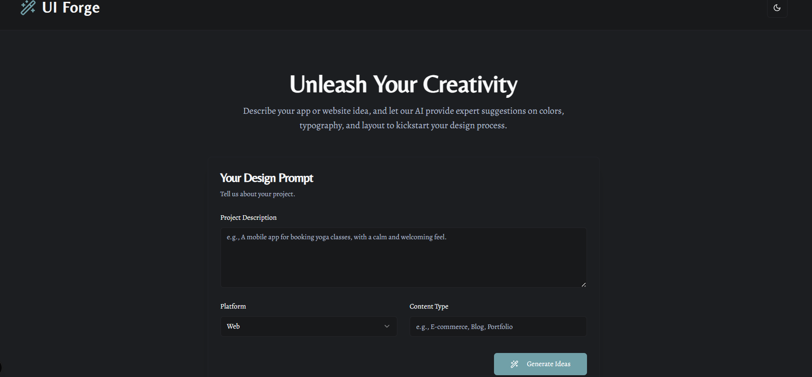
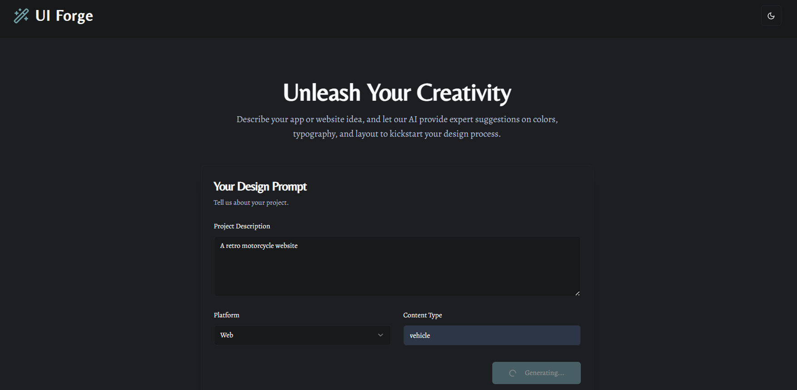
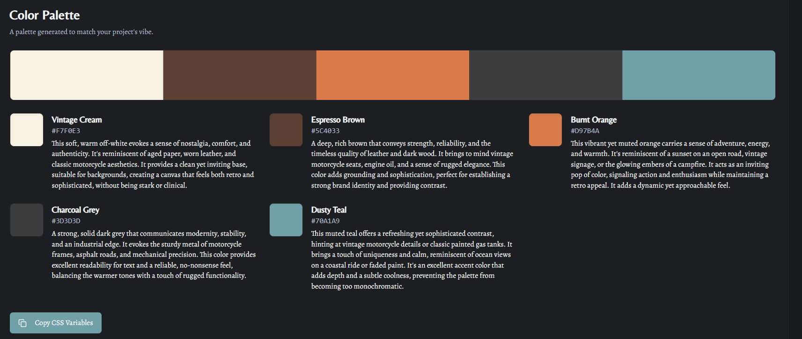
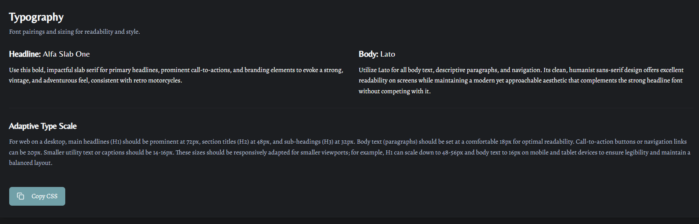
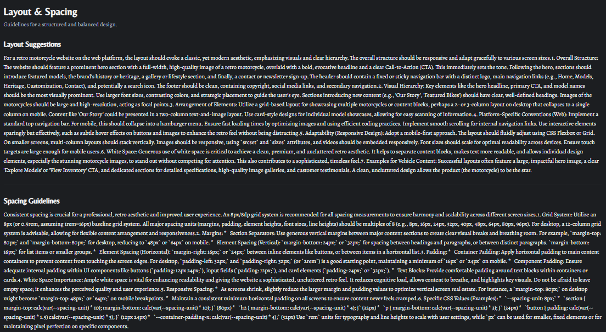

# 🎨 UI Forge — AI-Powered UI/UX Design Assistant

UI Forge helps budding designers transform ideas into design direction.  
Just describe your app or website concept in plain language, and UI Forge generates:

- 🎨 **Color Palette** — with the psychology and meaning behind each color  
- 🧠 **Typography Pairing** — recommended heading and body fonts  
- 📏 **Spacing & Layout Guidance** — suggested padding, margins, and grid size  
- 💡 **Design Rationale** — short explanations to help beginners understand choices  

---

## 🚀 Features

| Feature | Description |
|----------|-------------|
| 📝 **Prompt Input** | Enter a short description of your app or website idea |
| 🎨 **Color Suggestions** | Get palette options with meanings and usage guidance |
| 🧠 **Typography Advice** | Heading + body font pairing with reasoning |
| 📏 **Spacing & Layout** | Recommended spacing scale and design grid system |
| 💾 **Save & Export** | Copy or export your generated design guide |

---
## 🖼️ Screenshots

| Input Screen | AI Output Example |
|---------------|------------------|
|  |  | |  |  |

*(Add your screenshots in the `screenshots/` folder.)*

---

## 🌐 Live Preview
👉 [**Try UI Forge**]([https://your-preview-link-here.com](https://9000-firebase-studio-1760948921956.cluster-wurh6gchdjcjmwrw2tqtufvhss.cloudworkstations.dev))

*(You can host this using GitHub Pages, Firebase Hosting, or Vercel.)*

---

## 🧩 Example Use Case

**Prompt:**  
> “A travel booking app for young professionals that feels modern and trustworthy.”

**AI Output Example:**
- **Primary Colors:** Deep Blue (#004E89), Sky Blue (#9AD4D6)  
  → *Blue symbolizes trust and reliability; lighter blue adds freshness.*  
- **Typography:**  
  - **Heading:** Poppins (Bold)  
  - **Body:** Inter (Regular)  
  → *Clean and friendly fonts for a modern tech audience.*  
- **Spacing:**  
  - **8px grid system**  
  - **Section padding:** 24px  
  → *Creates consistent breathing space and visual rhythm.*

---

## 🧠 Tech Stack

| Layer | Technology |
|--------|-------------|
| 🎯 **Frontend** | React.js / Next.js + Tailwind CSS |
| ⚙️ **Backend** | Node.js + Express.js |
| 🤖 **AI Integration** | OpenAI / Gemini API for prompt understanding |
| 🗃️ **Database (Optional)** | Firebase / MongoDB (for saving user inputs) |
| ☁️ **Hosting** | Firebase / Vercel / GitHub Pages |

---

